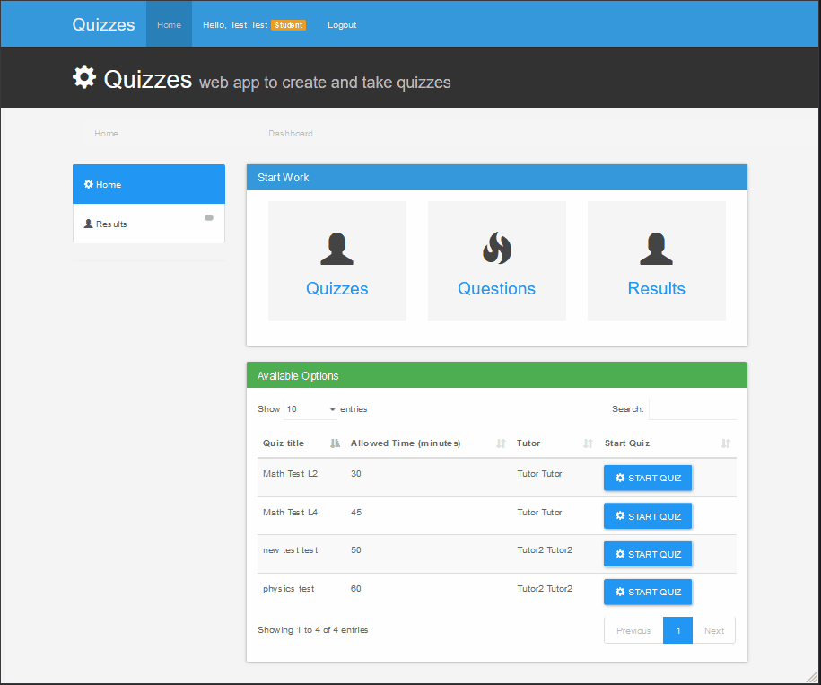

# QuizWebApp
Quiz web app to create and take quizzes, using PHP and CodeIgniter 3
  
 
 
Using [CodeIgniter](https://codeigniter.com/ "CodeIgniter") v3 this website allows you to create Quizzes and also take them

## run the APP
- Create a new DataBase using mysql, and import DataBase.sql to it.
- Set your DataBase credentials to the file "application/config/database.php"
- enjoy

